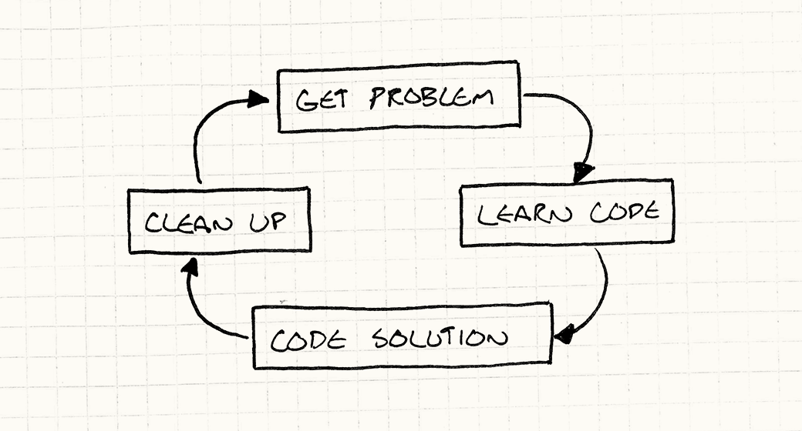

# Architecture, Performance, and Games
[Contents](./readme.md#contents)

## What is Software Architecture?

If you read this book cover to cover, you won't come away knowing the linear algebra behind 3D graphics or the calculus behind game physics. It won't show you how to alpha-beta prune your AI's search tree or simulate a room's reverberation in your audio playback.

Instead, this book is about the code *between* all of that. It's less about writing code than it is about *organizing* it.

### What is *good* software architecture?

Good design means that when I make a change, it's as if the entire program was crafted in anticipation of it. The first key piece is that *architecture is about change*. Someone has to be modifying the codebase. If no one is touching the code the design is irrelevant. The measure of a design is how easily it accomodates changes.

### How do you make a change?

Before you can change the code to add a new feature, you have to understand what the existing code is doing. You don't have to know the whole program, but you need to load all of the relevant pieces of it into your primate brain.

We tend to gloss over this step, but it's often the most time-consuming part of programming. If you think paging some data from disk into RAM is slow, try paging it into a simian cerebrum over a pair of optic nerves.

Once you've got all the right context, you think for a bit and figure out your solution. There can be a bit of back and forth here, but often this is relatively straightforward. Once you understand the problem and the parts of the code it touches, the actual coding is sometimes trivial.

Before sending it off for code review, you often have some cleanup to do. You don't want the next person to come along to trip over the wrinkles you left throughout the source. Unless the change is minor, there's usually a bit of reorganization to do to make your new code integrate seamlessly with the rest of the program. If you do it right, the next person to come along won't be able to tell when any line of code was written.

  

> A practice that I use when possible is to solve the problem in isolation from the code base. Most of the time, the problem that you are trying to solve deals with a more fundamental aspect of a framework or language feature rather than your application infrastructure. Solving the problem in isolation allows you to rapidly iterate and perfect the solution before integrating it into your application.

### How can decoupling help?

I think much of software architecture is about that learning phase. Loading code into neurons is so painfully slow that it pays to find strategies to reduce the volume of it. This book has an entire section on [*decoupling patterns*](https://gameprogrammingpatterns.com/decoupling-patterns.html).

If two pieces of code are coupled, it means you can't understand one without understanding the other. If you *de*-couple them, you can reason about either side independently.

This is a key goal of software architecture: **minimize the amount of knowledge you need to have in-cranium before you can make progress.**

Another definition of decoupling is that a change to one piece of code doesn't necessitate a change to another. The less coupling, the less that change ripples throughout the rest of the code base.

## At What Cost?

Good architecture takes real effort and discipline. Every time you make a change or implement a feature, you have to work hard to integrate it gracefully into the rest of hte program. You have to take great care to both organize the code well and *keep* it organized throughout the thousands of little changes that make up a development cycle.

Whenever you add a layer of abstraction or a place where extensibility is supported, you're *speculating* that you will need that flexibility later. You're adding code and complexity to your code base that takes time to develop, debug, and maintain.

The effort pays off if you guess right and end up touching that code later. But predicting the future is *hard*, and when that modularity doesn't end up being helpful, it quickly becomes actively harmful. After all, it is more code you have to deal wtih.

> Some folks coined the term "YAGNI" - [You aren't gonna need it](http://en.wikipedia.org/wiki/You_aren't_gonna_need_it) - as a mantra to use to fight this urge to speculate about what your future self may want.

It's easy to get so wrapped up in the code itself that you lose sight of the fact that you're trying to deliver an application.

## Performance and Speed

A common critique of software architecture and abstraction is that it hurts performance. Many patterns that make your code more flexible rely on virtual dispatch, interfaces, pointers, messages, and other mechanisms that all have at least some runtime cost. There's a reason for this. A lot of software architecture is about making your program more flexible. It's about making it take less effort to change it. THat means encoding fewer assumptions in the program.

Performance is all about assumptions. The practice of optimization thrives on concrete limitations. This doesn't mean flexibility is bad, though. It lets us change our program quickly, and *development* speed is absolutely vital for getting to a fun experience. The faster you can try out ideas and see how they feel, the more you can try and the more likely you are to find something great. Even after you've found the right mechanics, you need plenty of time for tuning.

Making your program more flexible so you can prototype faster will have some performance cost. Likewise, optimizing your code will make it less flexible. It's easier to make a fun game fast than it is to make a fast game fun.

## The Good in Bad Code

Writing well-architected code takes careful thought, and that translates to time. Moreso, *maintaining* a good architecture over the life of a project takes a lot of effort. You have to treat your codebase like a good camper does their campsite: always try to leave it a little better than you found it.

This is good when you're going to be living in and working on that code for a long time. Writing apps requires a lot of experimentation and exploration. Especially early on, it's common to write code that you *know* you'll throw away.

If you want to find out if some gameplay idea plays right at all, architecting it beautifully means burning more time before you actually get it on screen and get some feedback. If it ends up not working, that time spent making the code elegant goes to waste when you delete it.

Prototyping - slapping together code that's just barely functional enough to answer a design question - is a perfectly legitimate programming practice. There is a very large caveat, though. If you write throwaway code, you *must* ensure you're able to throw it away. You need to make sure the people using the throwaway code understand that even though it kind of looks like it works, it *cannot* be maintained and *must* be rewritten. If there's a *chance* you'll end up having to keep it around, you may have to defensively write it well.

## Striking a Balance

1. We want nice architecture sot ath code is easier to understand over the lifetime of the project.
2. We want fast runtime performance.
3. We want to get today's features done quickly.

These goals are at least partially in opposition. Good architecture improves productivity over the long term, but maintaining it means every change requires a little more effort to keep things clean.

The implementation that's quickest to write is rarely the quickest to *run*. Instead, optimization takes significant engineering time. Once it's done, it tends to calcify the code base: highly optimized code is inflexible and very difficult to change.

There's always pressure to get today's work done today and worry about everything else tomorrow. But if we cram in features as quickly as we can, our codebase will become a mess of hacks, bugs, and inconsistencies that saps our future productivity.

There's no simple answer here, just trade-offs. It's intimidating to hear "there is no right answer, just different flavors of wrong." If there was an easy answer, everyone would just do that.

A field you can master in a week is ultimately boring. A game like chess can never be mastered because all of the pieces are so perfectly balanced against one another. You can spend your life exploring the vast space of viable strategies. A poorly designed game collapses to the one winning tactic played over and over until you get bored and quit.

## Simplicity

I feel like if there is any method that eases these constraints, it's *simplicity*. I try very hard to write the cleanest, most direct solution to the problem. The kind of code where after you read it, you understand exactly what it does and can't imagine any other possible solution.

I aim to get the data structures and algorithms right (in about that order) and then go from there. If I can keep things simple, there's less overall code. That means less code to load into my head in order to change it. It often runs fast because there's simply not as much overhead and not much code to execute.

When we think of elegant solutions, what we often have in mind is a *general* one: a small bit of logic that still correctly covers a large space of use cases. Finding that is a bit like pattern matching or solving a puzzle. It takes effort to see through the scattering of example use cases to find the hidden order underlying them all. It's a great feeling when you pull it off.

## Get On With It, Already

* Abstraction and decoupling make your program faster and easier, but don't waste time doing them unless you're confident the code in question needs that flexibility.

* Think about and design for performance throughout your development cycle, but put off the low-level, nitty-gritty optimizations that lock assumptions into your code until as late as possible.

* Move quickly to explore your app's design space, but don't go so fast that you leave a mess behind you. You'll have to live with it, after all.

* If you're going to ditch code, don't waste time making it pretty. Rock stars trash hotel rooms because they know they're going to check out the next day.

* **If you want to make something fun, have fun making it.**