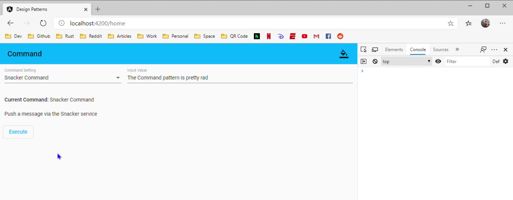
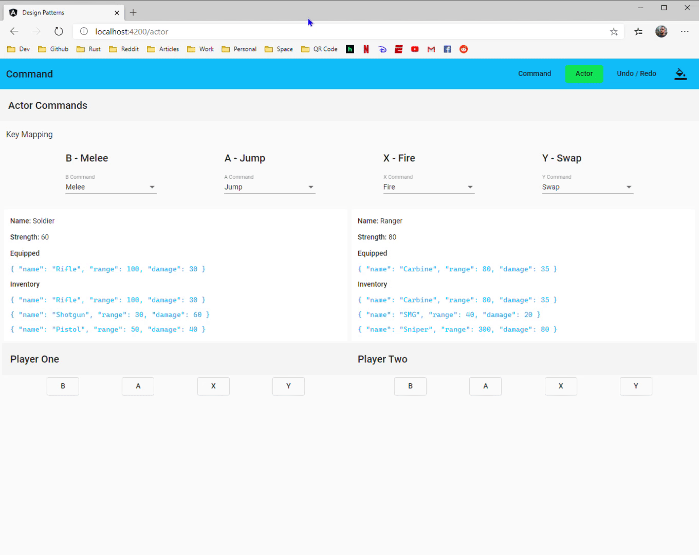

# Command
[Contents](./readme.md#contents)  

> Encapsulate a request as an object, thereby letting users parameterize clients with different requests, queue or log requests, and support un-doable operations.

**A command is a *reified method call.***

> "Reify" comes from the Latin "res", for "thing", with the English suffix "-fy". So it basically means "thingify". It basically means "make real", or in this context, making something "first class".

Essentially, this means taking some *concept* and turning it into a piece of *data* - an object - that you can stick in a variable, pass to a function, etc. So by saying the Command pattern is a "reified method call", what I mean is that it's a method call wrapped in an object.

The Gang of Four later says:

> Commands are object-oriented replacements for callbacks.  

## Configure Button Action

[](./.gifs/command-pattern_1.gif)  

> Examples for this chapter can be found in the [02.command](./02.command) directory.

**src/app/models/command/command.ts**

```ts
export interface Command {
  label: string;
  description: string;
  execute: (val: string) => void;
}
```

**src/app/models/command/alert-command.ts**

```ts
import { Command } from './command';

export class AlertCommand implements Command {
  label = 'Alert Command';
  description = 'Trigger a window alert';

  execute = (val: string) => window.alert(val ? val : this.label);
}
```

**src/app/models/command/log-command.ts**  

```ts
import { Command } from './command';

export class LogCommand implements Command {
  label = 'Log Command';
  description = 'Log a command to the console';

  execute = (val: string) => console.log(val ? val : this.label);
}
```

**src/app/models/command/snacker-command**

```ts
import { Command } from './command';
import { SnackerService } from '../../services';

export class SnackerCommand implements Command {
  constructor(
    public snacker: SnackerService
  ) { }

  label = 'Snacker Command';
  description = 'Push a message via the Snacker service';

  execute = (val: string) => this.snacker.sendColorMessage(
    val ? val : this.label,
    ['snacker-indigo']
  );
}
```

**src/app/routes/command/command.component.ts**

```ts
import { Component } from '@angular/core';

import {
  AlertCommand,
  Command,
  LogCommand,
  SnackerCommand
} from '../../models';

import { MatSelectChange } from '@angular/material/select';
import { SnackerService } from '../../services';

@Component({
  selector: 'command-route',
  templateUrl: './command.component.html',
})
export class CommandComponent {
  commands = new Array<Command>(
    new AlertCommand(),
    new LogCommand(),
    new SnackerCommand(this.snacker)
  );

  command: Command = new SnackerCommand(this.snacker);

  constructor(
    public snacker: SnackerService
  ) { }

  setCommand = (event: MatSelectChange) => this.command = event.value;

  compareCommands = (c1: Command, c2: Command) => c1 && c2 && c1.label === c2.label;
}
```

**src/app/routes/command/command.component.html**

```html
<mat-toolbar>Configure Button Action</mat-toolbar>
<section fxLayout="column"
         fxLayoutAlign="start stretch"
         class="container">
  <section fxLayout="row"
           fxLayoutAlign="start center">
    <mat-form-field fxFlex="33">
      <mat-label>Command Setting</mat-label>
      <mat-select [value]="command"
                  [compareWith]="compareCommands"
                  (selectionChange)="setCommand($event)">
        <mat-option *ngFor="let c of commands"
                    [value]="c">{{c.label}}</mat-option>
      </mat-select>
    </mat-form-field>
    <mat-form-field fxFlex="66">
      <mat-label>Input Value</mat-label>
      <input matInput
             #val
             (keydown.enter)="command.execute(val.value)" />
    </mat-form-field>
  </section>
  <p><span class="mat-body-strong">Current Command:</span> {{command.label}}</p>
  <p>{{command.description}}</p>
</section>
<button mat-stroked-button
        color="primary"
        [style.margin.px]="8"
        (click)="command.execute(val.value)">Execute</button>
```

## Actor Action Commands  

[](./.gifs/command-pattern_2.gif)

**src/app/models/weapon/weapon.ts**

```ts
export class Weapon {
  name: string;
  range: number;
  damage: number;

  constructor(
    name: string,
    range: number,
    damage: number
  ) {
    this.name = name;
    this.range = range;
    this.damage = damage
  }

  fire = () => `${this.name} fired a distance of ${this.range} for ${this.damage} damage`;
}
```

**src/app/models/actor/actor.ts**

```ts
import { Weapon } from '../weapon';

export class Actor {
  name: string;
  strength: number;
  equipped: Weapon;
  inventory: Weapon[];

  constructor(
    name: string,
    strength: number,
    inventory: Weapon[]
  ) {
    this.name = name;
    this.strength = strength;
    this.inventory = inventory;
    this.equipped = inventory[0];
  }

  fire = () => this.equipped
    ? this.equipped.fire()
    : `${this.name} is not holding a weapon`;

  jump = () => `${this.name} jumped a distance of ${Math.floor(this.strength / 2)}`;

  melee = () => `${this.name} punched for ${this.strength} damage`;

  swap = () => {
    if (this.equipped && this.inventory && this.inventory.length) {
      if (this.inventory.length === 1)
        return `${this.name} only has ${this.equipped.name} available`;

      const index = this.inventory.indexOf(this.equipped);

      this.equipped = index === this.inventory.length - 1
        ? this.inventory[0]
        : this.inventory[index + 1];

      return `${this.name} equipped ${this.equipped.name}`;
    } else
      return `${this.name} has an empty inventory`;
  }
}
```

**src/app/models/actor/commands/actor-command.ts**

```ts
import { Actor } from '../actor';

export interface ActorCommand {
  label: string;
  description: string;
  execute: (actor: Actor) => string;
}
```

**src/app/models/actor/commands/fire-command.ts**

```ts
import { Actor } from '../actor';
import { ActorCommand } from './actor-command';

export class FireCommand implements ActorCommand {
  label = 'Fire';
  description = 'Causes the actor to fire the equipped weapon';
  execute = (actor: Actor) => actor.fire();
}
```

**src/app/models/actor/commands/jump-command.ts**

```ts
import { Actor } from '../actor';
import { ActorCommand } from './actor-command';

export class JumpCommand implements ActorCommand {
  label = 'Jump';
  description = 'Causes the actor to jump';
  execute = (actor: Actor) => actor.jump();
}
```

**src/app/models/actor/commands/melee-command.ts**

```ts
import { Actor } from '../actor';
import { ActorCommand } from './actor-command';

export class MeleeCommand implements ActorCommand {
  label = 'Melee';
  description = 'Causes the actor to punch';
  execute = (actor: Actor) => actor.melee();
}
```

**src/app/models/actor/commands/swap-command.ts**

```ts
import { Actor } from '../actor';
import { ActorCommand } from './actor-command';

export class SwapCommand implements ActorCommand {
  label = 'Swap';
  description = 'Causes the actor to swap the equipped weapon';
  execute = (actor: Actor) => actor.swap();
}
```

**src/app/routes/actor/actor.component.ts**

```ts
import { Component } from '@angular/core';

import {
  Actor,
  ActorCommand,
  FireCommand,
  JumpCommand,
  MeleeCommand,
  SwapCommand,
  Weapon
} from '../../models';

import { MatSelectChange } from '@angular/material/select';

@Component({
  selector: 'actor-route',
  templateUrl: './actor.component.html',
})
export class ActorComponent {
  actorOne: Actor;
  actorTwo: Actor;

  actorCommands = new Array<ActorCommand>(
    new FireCommand(),
    new JumpCommand(),
    new MeleeCommand(),
    new SwapCommand()
  );

  aCommand: ActorCommand = new JumpCommand();
  bCommand: ActorCommand = new MeleeCommand();
  xCommand: ActorCommand = new FireCommand();
  yCommand: ActorCommand = new SwapCommand();

  oneWeapons = new Array<Weapon>(
    new Weapon('Rifle', 100, 30),
    new Weapon('Shotgun', 30, 60),
    new Weapon('Pistol', 50, 40)
  );

  twoWeapons = new Array<Weapon>(
    new Weapon('Carbine', 80, 35),
    new Weapon('SMG', 40, 20),
    new Weapon('Sniper', 300, 80)
  );

  oneActions = new Array<string>();
  twoActions = new Array<string>();

  constructor() {
    this.actorOne = new Actor('Soldier', 60, this.oneWeapons);
    this.actorTwo = new Actor('Ranger', 80, this.twoWeapons);
  }

  setActorCommand(event: MatSelectChange, command: string) {
    switch (command) {
      case 'b':
        this.bCommand = event.value;
        return;
      case 'a':
        this.aCommand = event.value;
        return;
      case 'x':
        this.xCommand = event.value;
        return;
      case 'y':
        this.yCommand = event.value;
        return;
    }
  }

  compareActorCommands = (c1: ActorCommand, c2: ActorCommand) => c1 && c2 && c1.label === c2.label;

  execute = (command: ActorCommand, actor: Actor, actions: string[]) => {
    if (actions.length >= 4) actions.pop();

    actions.unshift(command.execute(actor));
  }
}
```

**src/app/routes/actor/actor.component.html**

```html
<mat-toolbar>Actor Commands</mat-toolbar>
<section fxLayout="column"
         fxLayoutAlign="start stretch"
         class="container">
  <p class="mat-subheading-2">Key Mapping</p>
  <section fxLayout="row | wrap"
           fxLayoutAlign="space-evenly center">
    <section fxLayout="column"
             fxLayoutAlign="start stretch">
      <p class="mat-title">B - {{bCommand.label}}</p>
      <mat-form-field>
        <mat-label>B Command</mat-label>
        <mat-select [value]="bCommand"
                    [compareWith]="compareActorCommands"
                    (selectionChange)="setActorCommand($event, 'b')">
          <mat-option *ngFor="let c of actorCommands"
                      [value]="c">{{c.label}}</mat-option>
        </mat-select>
      </mat-form-field>
    </section>
    <section fxLayout="column"
             fxLayoutAlign="start stretch">
      <p class="mat-title">A - {{aCommand.label}}</p>
      <mat-form-field>
        <mat-label>A Command</mat-label>
        <mat-select [value]="aCommand"
                    [compareWith]="compareActorCommands"
                    (selectionChange)="setActorCommand($event, 'a')">
          <mat-option *ngFor="let c of actorCommands"
                      [value]="c">{{c.label}}</mat-option>
        </mat-select>
      </mat-form-field>
    </section>
    <section fxLayout="column"
             fxLayoutAlign="start stretch">
      <p class="mat-title">X - {{xCommand.label}}</p>
      <mat-form-field>
        <mat-label>X Command</mat-label>
        <mat-select [value]="xCommand"
                    [compareWith]="compareActorCommands"
                    (selectionChange)="setActorCommand($event, 'x')">
          <mat-option *ngFor="let c of actorCommands"
                      [value]="c">{{c.label}}</mat-option>
        </mat-select>
      </mat-form-field>
    </section>
    <section fxLayout="column"
             fxLayoutAlign="start stretch">
      <p class="mat-title">Y - {{yCommand.label}}</p>
      <mat-form-field>
        <mat-label>Y Command</mat-label>
        <mat-select [value]="yCommand"
                    [compareWith]="compareActorCommands"
                    (selectionChange)="setActorCommand($event, 'y')">
          <mat-option *ngFor="let c of actorCommands"
                      [value]="c">{{c.label}}</mat-option>
        </mat-select>
      </mat-form-field>
    </section>
  </section>
  <section fxLayout="row | wrap"
           fxLayoutAlign="start stretch">
    <section class="background card container"
             fxFlex>
      <p><span class="mat-body-strong">Name:</span> {{actorOne.name}}</p>
      <p><span class="mat-body-strong">Strength:</span> {{actorOne.strength}}</p>
      <p class="mat-body-strong">Equipped</p>
      <p><code class="snippet">{{actorOne.equipped | json}}</code></p>
      <p class="mat-body-strong">Inventory</p>
      <p *ngFor="let w of actorOne.inventory"><code class="snippet">{{w | json}}</code></p>
    </section>
    <section class="background card container"
             fxFlex>
      <p><span class="mat-body-strong">Name:</span> {{actorTwo.name}}</p>
      <p><span class="mat-body-strong">Strength:</span> {{actorTwo.strength}}</p>
      <p class="mat-body-strong">Equipped</p>
      <p><code class="snippet">{{actorTwo.equipped | json}}</code></p>
      <p class="mat-body-strong">Inventory</p>
      <p *ngFor="let w of actorTwo.inventory"><code class="snippet">{{w | json}}</code></p>
    </section>
  </section>
  <section fxLayout="row | wrap"
           fxLayoutAlign="start stretch">
    <section fxLayout="column"
             fxLayoutAlign="start stretch"
             fxFlex>
      <mat-toolbar>Player One</mat-toolbar>
      <section fxLayout="row | wrap"
               fxLayoutAlign="space-evenly center"
               class="container">
        <button mat-stroked-button
                (click)="execute(bCommand, actorOne, oneActions)">B</button>
        <button mat-stroked-button
                (click)="execute(aCommand, actorOne, oneActions)">A</button>
        <button mat-stroked-button
                (click)="execute(xCommand, actorOne, oneActions)">X</button>
        <button mat-stroked-button
                (click)="execute(yCommand, actorOne, oneActions)">Y</button>
      </section>
    </section>
    <section fxLayout="column"
             fxLayoutAlign="start stretch"
             fxFlex>
      <mat-toolbar>Player Two</mat-toolbar>
      <section fxLayout="row | wrap"
               fxLayoutAlign="space-evenly center"
               class="container">
        <button mat-stroked-button
                (click)="execute(bCommand, actorTwo, twoActions)">B</button>
        <button mat-stroked-button
                (click)="execute(aCommand, actorTwo, twoActions)">A</button>
        <button mat-stroked-button
                (click)="execute(xCommand, actorTwo, twoActions)">X</button>
        <button mat-stroked-button
                (click)="execute(yCommand, actorTwo, twoActions)">Y</button>
      </section>
    </section>
  </section>
  <section fxLayout="row | wrap"
           fxLayoutAlign="start stretch"
           class="container">
    <section class="background card"
             fxFlex>
      <p *ngFor="let action of oneActions">
        <code class="snippet alt">{{action}}</code>
      </p>
    </section>
    <section class="background card"
             fxFlex>
      <p *ngFor="let action of twoActions">
        <code class="snippet alt">{{action}}</code>
      </p>
    </section>
  </section>
</section>
```

[Next - Flyweight](./2-03.flyweight.md)  

[Previous - Design Patterns Revisited](./2.design-patterns-revisited.md)