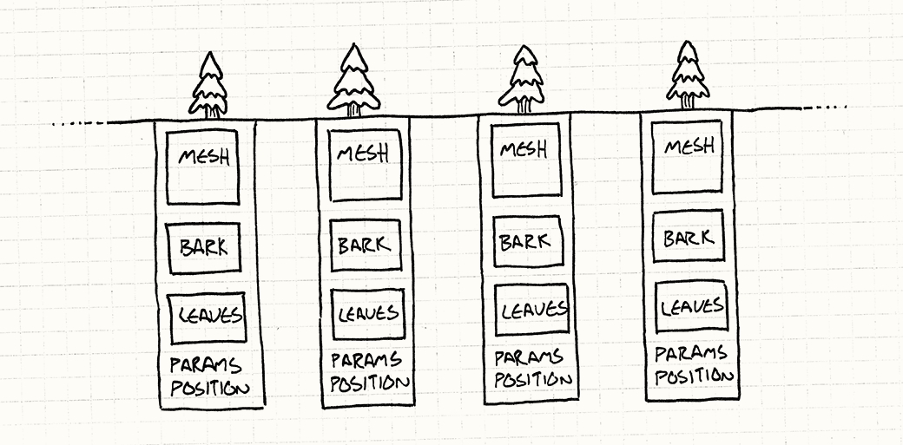
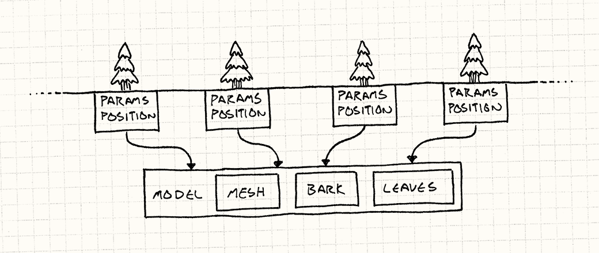
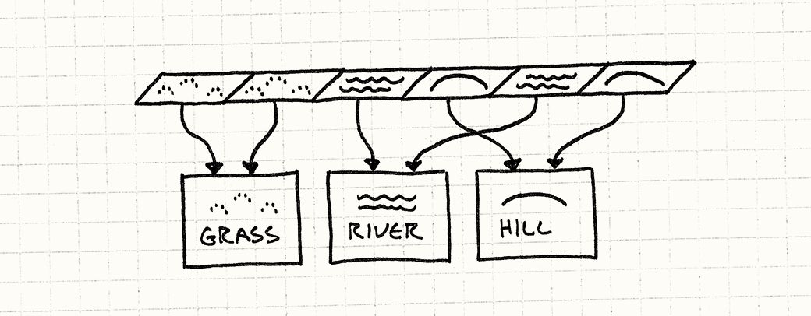

# Flyweight
[Contents](./readme.md#contents)  

> Use sharing to support large numbers of fine-grained objects efficiently.

Flyweight, like its name implies, comes into play when you have objects that need to be more lightweight, generally because you have too many of them.

The pattern solves it by separating an object's data into two kinds. The first kind of data is the stuff that's not specific to a single *instance* of that object and can be shared across all of them. The Gang of Four calls this the *intrinsic* state, but I like to think of it as the "context-free" stuff.

The rest of the data is the *extrinsic* state, the stuff that is unique to that instance. The pattern saves memory by sharing one copy of the intrinsic state across every place where an object appears.

I find this pattern to be less obvious (and thus more clever) when used in cases where there isn't a really well-defined identity for the shared object. In those cases, it feels more like an object is magically in multiple places at the same time.

Sharing objects to save memory should be an optimization that doesn't affect the visible behavior of the app. Because of this, Flyweight objects are almost always immutable.

> Because of Flyweight's reliance on references and pointers, there is not a particularly relevant example for use with TypeScript. Potentially down the line, when working with complex C# features outside of typical web back end functionality, Flyweight could prove beneficial.
>
> For this purpose, the examples laid out in the book will suffice here.

## Forest for the Trees

I can describe a sprawling woodland with just a few sentences, but actually *implementing* it in a realtime game is another story. When you've got an entire forest of individual trees filling the screen, all that a graphics programmer sees is the millions of polygons they'll have to somehow shovel onto the GPU every sixtieth of a second.

We're talking thousands of trees, each with detailed geometry containing thousands of polygons. Even if you have enough *memory* to describe that forest, in order to render it, that data has to make its way over the bus from the CPU to the GPU.

Each tree has a bunch of bits associated with it:
* A mesh of polygons that define the shape of the trunk, branches, and greenery.
* Textures for the bark and leaves.
* Its location and orientation in the forest.
* Tuning parameters like size and tint so that each tree looks different.

If you were to sketch it out in code, you might have something like this:

```cpp
class Tree
{
    private:
        Mesh mesh_;
        Texture bark_;
        Texture leaves_;
        Vector position_;
        double height_;
        double thickness_;
        Color barkTint_;
        Color leafTint_;
};
```

That's a lot of data, and the mesh and textures are particularly large. An entire forest of these objects is too much to throw at the GPU in one frame.

The key observation is that even though there may be thousands of trees in the forest, they mostly look similar. They will likely all use the same mesh and textures. That means most of the fields in these objects are the *same* between all of those instances.

[](./.images/03.flyweight-trees.png)

We can model that explicitly by splitting the object in half. First, we pull out the data that all trees have in common and move it into a separate class:

```cpp
class TreeModel
{
    private:
        Mesh mesh_;
        Texture bark_;
        Texture leaves_;
};
```

The game only needs a single one of those, since there's no reason to have the same meshes and textures in memory a thousand times. Then, each *instance* of a tree in the world has a *reference* to that shared `TreeModel`. What remains in `Tree` is the state that is instance-specific:

```cpp
class Tree
{
    private:
        TreeModel* model_;

        Vector position_;
        double height_;
        double thickness_;
        Color barkTint_;
        Color leafTint_;
};
```

You can visualize it like this:

[](./.images/04.flyweight-tree-model.png)

This still doesn't help rendering. Before the forest gets on screen, it has to work its way over to the GPU. We need to express this resource sharing in a way that the graphics card understands.

To minimize the amount of data we have to push to the GPU, we want to be able to send the shared data - the `TreeModel` - just *once*. Then, separately, we push over every tree instance's unique data - it's position, color, and scale. Finally we tell the GPU, "Use that one model to render each of these instances."

Fortunately, today's graphics APIs and cards support exactly that. Both Direct3D and OpenGL can do something called [instanced rendering](http://en.wikipedia.org/wiki/Geometry_instancing).

In both APIs, you provide two streams of data. The first is the blob of common data that will be rendered multiple times - the mesh and textures in our arboreal example. The second is the list of instances nad their parameters that will be used to vary that first chunk of data each time it's drawn. WIth a single draw call, an entire forest grows.

## A Place to Put Down Roots

The ground these trees are growing on needs to be represented in the game too. There can be patches of grass, dirt, hills, lakes, rivers, and whatever other terrain you can dream up. We'll make the ground *tile-based*: the surface of the world is a huge grid of tiny tiles. Each tile is covered in one kind of terrain.

Each terrain type has a number of properties that affect gameplay:

* A movement cost that determines how quickly players can move through it.
* A flag for whether it's a watery terrain that can be crossed by boats.
* A texture used to render it.

A common approach to avoid storing all of the state in each tile int he world is to use an enum for terrain types:

```cpp
enum Terrain
{
    TERRAIN_GRASS,
    TERRAIN_HILL,
    TERRAIN_RIVER,
    //\ Other terrains...
};
```

Then the world maintains a huge grid of those:

```cpp
class World
{
    private:
        Terrain tiles_[WIDTH][HEIGHT];
};
```

To actually get the useful data bout a tile, we do something like:

```cpp
int World::getMovementCost(int x, int y)
{
    switch (tiles_[x][y])
    {
        case TERRAIN_GRASS: return 1;
        case TERRAIN_HILL: return 3;
        case TERRAIN_RIVER: return 2;
        // Other terrains...
    }
}

bool World::isWater(int x, int y)
{
    switch (tiles_[x][y])
    {
        case TERRAIN_GRASS: return false;
        case TERRAIN_HILL: return false;
        case TERRAIN_RIVER: return true;
        // Other terrains...
    }
}
```

This works, but it's ugly. I think of movement cost and wetness as *data* about a terrain, bu here that's embedded in code. Worse, the data for a single terrain type is smeared across a bunch of methods. It would be really nice to keep all of that encapsulated together.

```cpp
class Terrain
{
    public:
        Terrain(int movementCost,
                bool isWater,
                Texture texture)
        : movementCost_(movementCost),
          isWater_(isWater)
          texture_(texture)
        {}

        int getMovementCost() const { return movementCost_; }
        bool isWater() const { return isWater_; }
        const Texture& getTexture() const { return texture_; }

    private:
        int movementCost_;
        bool isWater_;
        Texture texture_;
};
```

We don't want to pay the cost of having an instance of that for each tile in the world. If you look at that class, you'll notice that there's actually *nothing* in there that's specific to *where* that tile is. In flyweight terms, *all* of a terrain's state is "intrinsic" or "context-free".

Given that, there's no reason to have more than one of each terrain type. Every grass tile on the ground is identical to every other one. Instead of having the world be a grid of enums or Terrain objects, it will be a grid of *pointers* to `Terrain` objects:

```cpp
class World
{
    private:
        Terrain* tiles_[WIDTH][HEIGHT];

        // Other stuff...
};
```

Each tile that uses the same terrain will point to the same terrain instance:

[](./.images/05.flyweight-tiles.png)

Since the terrain instances are used in multiple places, their lifetimes would be a little more complex to manage if you were to dynamically allocate them. Instead, we'll just store them directly in the world:

```cpp
class World
{
    public:
        World()
        : grassTerrain_(1, false, GRASS_TEXTURE),
          hillTerrain_(3, false, HILL_TEXTURE),
          riverTerrain_(2, true, RIVER_TEXTURE)
        {}

    private:
        Terrain grassTerrain_;
        Terrain hillTerrain_;
        Terrain riverTerrain_;

        // Other stuff...
};
```

Then we can use those to paint the ground like this:

```cpp
void World::generateTerrain()
{
    // Fill the ground with grass.
    for (int x = 0; x < WIDTH; x++)
    {
        for (int y = 0; i < HEIGHT; y++)
        {
            // Sprinkle some hills
            if (random(10) == 0)
            {
                tiles_[x][y] = &hillTerrain_;
            }
            else
            {
                tiles_[x][y] = &grassTerrain_;
            }
        }
    }

    // Lay a river.
    int x = random(WIDTH);
    for (int y = 0; y < HEIGHT; y++)
    {
        tiles_[x][y] = &riverTerrain_;
    }
}
```

Now instead of methods on `World` for accessing teh terrain properties, we can expose the `Terrain` object directly:

```cpp
const Terrain&  World::getTile(int x, int y) const
{
    return *tiles_[x][y];
}
```

This way, `World` is no longer coupled to all sorts of details of terrains. If you want some property of the tile, you can get it right from that object:

```cpp
int cost = world.getTile(2, 3)
    .getMovementCost();
```

[Next - Observer](./2-04.observer.md)  

[Previous - Command](./2-02.command.md)